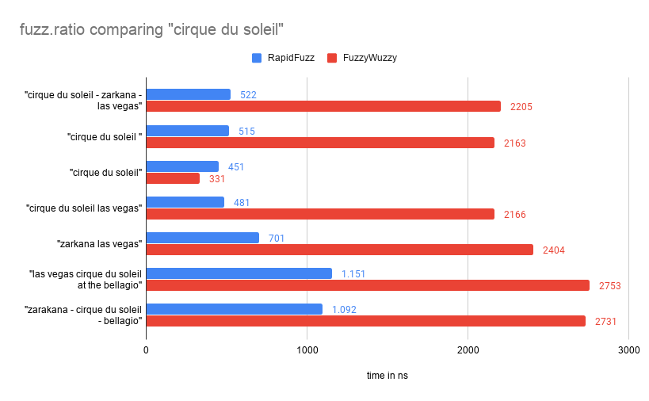
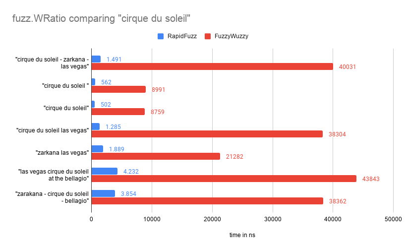

# Benchmarks

To compare the speed of FuzzyWuzzy and RapidFuzz the Benchmark of FuzzyWuzzy is used.
Therefore the Benchmark is always executed for both FuzzyWuzzy and RapidFuzz.
Afterwards a ratio between the runtime of both results is calculated. The benchmark can be found [here](https://github.com/rhasspy/rapidfuzz/blob/master/python/bench). The results of the benchmarks are visualised below.

## fuzz.ratio

## fuzz.partial_ratio

## fuzz.WRatio

