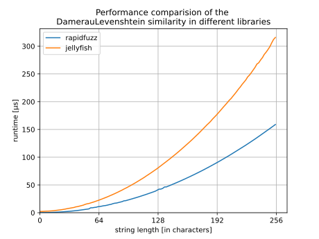

Damerau Levenshtein
-------------------

Functions
^^^^^^^^^

distance
~~~~~~~~
.. autofunction:: rapidfuzz.distance.DamerauLevenshtein.distance

normalized_distance
~~~~~~~~~~~~~~~~~~~
.. autofunction:: rapidfuzz.distance.DamerauLevenshtein.normalized_distance

similarity
~~~~~~~~~~
.. autofunction:: rapidfuzz.distance.DamerauLevenshtein.similarity

normalized_similarity
~~~~~~~~~~~~~~~~~~~~~
.. autofunction:: rapidfuzz.distance.DamerauLevenshtein.normalized_similarity

Performance
^^^^^^^^^^^
The following image shows a benchmark of the Damerau Levenshtein distance in
RapidFuzz and jellyfish. Both have a time complexity of ``O(NM)``. However RapidFuzz
only requires ``O(N + M)`` while the implementation in jellyfish requires
has a memory usage of ``O(NM)``.

