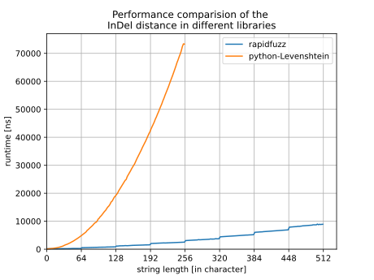

Indel
-----

Functions
^^^^^^^^^

distance
~~~~~~~~
.. autofunction:: rapidfuzz.distance.Indel.distance

normalized_distance
~~~~~~~~~~~~~~~~~~~
.. autofunction:: rapidfuzz.distance.Indel.normalized_distance

similarity
~~~~~~~~~~
.. autofunction:: rapidfuzz.distance.Indel.similarity

normalized_similarity
~~~~~~~~~~~~~~~~~~~~~
.. autofunction:: rapidfuzz.distance.Indel.normalized_similarity

editops
~~~~~~~
.. autofunction:: rapidfuzz.distance.Indel.editops

opcodes
~~~~~~~
.. autofunction:: rapidfuzz.distance.Indel.opcodes

Performance
^^^^^^^^^^^
The following image shows a benchmark of the Indel distance in RapidFuzz
and python-Levenshtein. Similar to the normal Levenshtein distance
python-Levenshtein uses an implementation with a time complexity of ``O(NM)``,
while RapidFuzz has a time complexity of ``O([score_cutoff/64]M)`` (and never worse than ``O([N/64]M)``).

Implementation Notes
^^^^^^^^^^^^^^^^^^^^

The following implementation is used with a worst-case performance of ``O([N/64]M)``.

- if max is 0 the similarity can be calculated using a direct comparison,
  since no difference between the strings is allowed.  The time complexity of
  this algorithm is ``O(N)``.

- if max is 1 and the two strings have a similar length, the similarity can be
  calculated using a direct comparison as well, since a substitution would cause
  a edit distance higher than max. The time complexity of this algorithm
  is ``O(N)``.

- A common prefix/suffix of the two compared strings does not affect
  the Levenshtein distance, so the affix is removed before calculating the
  similarity.

- If max is ≤ 4 the mbleven algorithm is used. This algorithm
  checks all possible edit operations that are possible under
  the threshold ``max``. As a difference to the normal Levenshtein distance this
  algorithm can even be used up to a threshold of 4 here, since the higher weight
  of substitutions decreases the amount of possible edit operations.
  The time complexity of this algorithm is ``O(N)``.

- If the length of the shorter string is ≤ 64 after removing the common affix
  Hyyrös' lcs algorithm is used, which calculates the Indel distance in
  parallel. The algorithm is described by :cite:t:`2004:hyrroe` and is extended with support
  for UTF32 in this implementation. The time complexity of this
  algorithm is ``O(N)``.

- If the length of the shorter string is ≥ 64 after removing the common affix
  a blockwise implementation of the Hyyrös' lcs algorithm is used, which calculates
  the Levenshtein distance in parallel (64 characters at a time).
  The algorithm is described by :cite:t:`2004:hyrroe`. The time complexity of this
  algorithm is ``O([score_cutoff/64]M)``.
