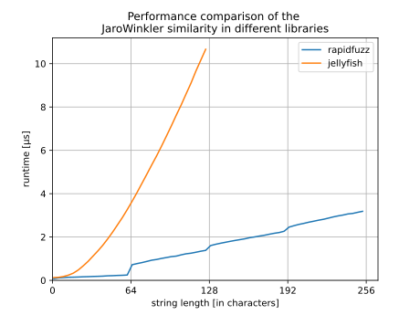

JaroWinkler
-----------

Functions
^^^^^^^^^

distance
~~~~~~~~
.. autofunction:: rapidfuzz.distance.JaroWinkler.distance

normalized_distance
~~~~~~~~~~~~~~~~~~~
.. autofunction:: rapidfuzz.distance.JaroWinkler.normalized_distance

similarity
~~~~~~~~~~
.. autofunction:: rapidfuzz.distance.JaroWinkler.similarity

normalized_similarity
~~~~~~~~~~~~~~~~~~~~~
.. autofunction:: rapidfuzz.distance.JaroWinkler.normalized_similarity

Performance
^^^^^^^^^^^
The following image shows a benchmark of the Jaro-Winkler similarity in RapidFuzz
and jellyfish. Jellyfish uses an implementation with a time complexity of ``O(NM)``,
while RapidFuzz has a time complexity of ``O([N/64]M)``.

