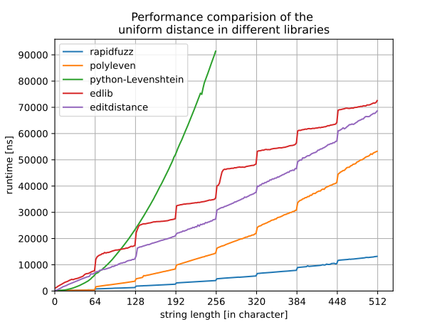

Levenshtein
-----------

.. automodule:: rapidfuzz.distance.Levenshtein

This implementation supports the usage of different weights for
Insertion/Deletion/Substitution. The uniform Levenshtein distance refers to ``weights=(1,1,1)``
and the Indel distance refers to ``weights=(1,1,2)``. All other weights are referred to
as generic Levenshtein distance.

Functions
^^^^^^^^^

distance
~~~~~~~~
.. autofunction:: rapidfuzz.distance.Levenshtein.distance

normalized_distance
~~~~~~~~~~~~~~~~~~~
.. autofunction:: rapidfuzz.distance.Levenshtein.normalized_distance

similarity
~~~~~~~~~~
.. autofunction:: rapidfuzz.distance.Levenshtein.similarity

normalized_similarity
~~~~~~~~~~~~~~~~~~~~~
.. autofunction:: rapidfuzz.distance.Levenshtein.normalized_similarity

editops
~~~~~~~
.. autofunction:: rapidfuzz.distance.Levenshtein.editops

opcodes
~~~~~~~
.. autofunction:: rapidfuzz.distance.Levenshtein.opcodes

Performance
^^^^^^^^^^^
Since the Levenshtein module uses different implementations based on the weights
used, this leads to different performance characteristics. The following sections
show the performance for the different possible weights.

Uniform
~~~~~~~
The following image shows a benchmark of the uniform Levenshtein distance in
multiple Python libraries. All of them are implemented either in C/C++ or Cython.
The graph shows, that python-Levenshtein is the only library with a time
complexity of ``O(NM)``, while all other libraries have a time complexity of
``O([N/64]M)``. Especially for long strings RapidFuzz is a lot faster than
all the other tested libraries.

Indel
~~~~~
The following image shows a benchmark of the Indel distance in RapidFuzz
and python-Levenshtein. Similar to the normal Levenshtein distance
python-Levenshtein uses an implementation with a time complexity of ``O(NM)``,
while RapidFuzz has a time complexity of ``O([N/64]M)``.

.. image:: img/indel_levenshtein.svg
    :align: center

Implementation Notes
^^^^^^^^^^^^^^^^^^^^
Depending on the used input parameters, different optimized implementation are used
to improve the performance. These implementations are described in the following
sections.

Uniform
~~~~~~~
The implementation for the uniform Levenshtein distance has a worst-case
performance of ``O([N/64]M)``. It uses the following optimized implementations:

- if score_cutoff is 0 the similarity can be calculated using a direct comparison,
  since no difference between the strings is allowed.  The time complexity of
  this algorithm is ``O(N)``.

- A common prefix/suffix of the two compared strings does not affect
  the Levenshtein distance, so the affix is removed before calculating the
  similarity.

- If score_cutoff is ≤ 3 the mbleven algorithm is used. This algorithm
  checks all possible edit operations that are possible under
  the threshold ``score_cutoff``. The time complexity of this algorithm is ``O(N)``.

- If the length of the shorter string is ≤ 64 after removing the common affix
  Hyyrös' algorithm is used, which calculates the Levenshtein distance in
  parallel. The algorithm is described by :cite:t:`2003:hyrroe`. The time complexity of this
  algorithm is ``O(N)``.

- If the length of the shorter string is ≥ 64 after removing the common affix
  a blockwise implementation of Hyyrös' algorithm is used, which calculates
  the Levenshtein distance in parallel (64 characters at a time).
  The algorithm is described by :cite:t:`2003:hyrroe`. The time complexity of this
  algorithm is ``O([N/64]M)``.

Indel
~~~~~
The Indel distance is available as a stand alone implementation. Further details
can be found in `here <Indel.html>`__.

Generic
~~~~~~~
The implementation for other weights is based on Wagner-Fischer.
It has a performance of ``O(N * M)`` and has a memory usage of ``O(N)``.
Further details can be found in :cite:t:`1974:WagFisch`.
