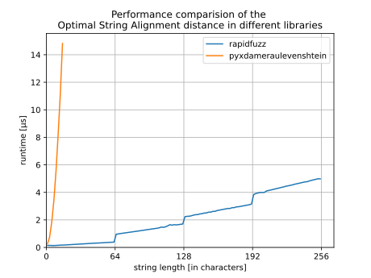

Optimal String Alignment (OSA)
------------------------------

Functions
^^^^^^^^^

distance
~~~~~~~~
.. autofunction:: rapidfuzz.distance.OSA.distance

normalized_distance
~~~~~~~~~~~~~~~~~~~
.. autofunction:: rapidfuzz.distance.OSA.normalized_distance

similarity
~~~~~~~~~~
.. autofunction:: rapidfuzz.distance.OSA.similarity

normalized_similarity
~~~~~~~~~~~~~~~~~~~~~
.. autofunction:: rapidfuzz.distance.OSA.normalized_similarity

Performance
^^^^^^^^^^^
The following image shows a benchmark of the optimal string alignment (OSA) distance in
RapidFuzz and pyxdameraulevenshtein. Both implementations have a memory usage
of ``O(N)``. However pyxdameraulevenshtein has a time complexity of ``O(NM)``,
while rapidfuzz has a time complexity of ``O([N/64]M)``.

